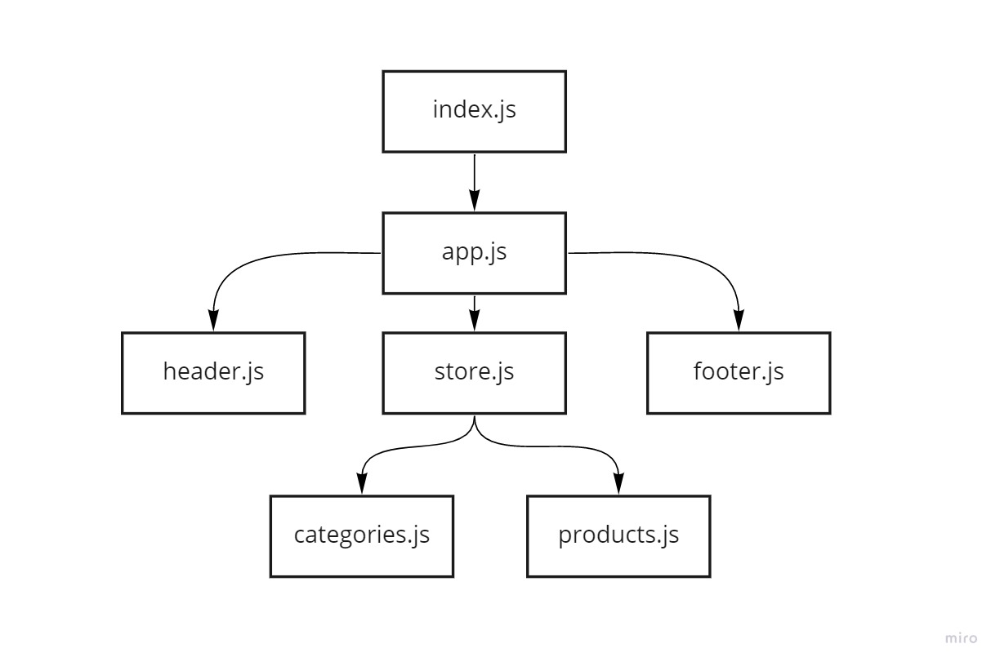

# storefront

## LAB - Application State with Redux

Virtual Store Phase 1: For this assignment, you will be starting the process of creating an e-Commerce storefront using React with Redux, coupled with your live API server

Virtual Store Phase 2: Continue work on the e-Commerce storefront, breaking up the store into multiple reducers and sharing functionality/data between components

## lab39

[deployed link](https://60dd5a214bb55b0007bc39f8--fervent-edison-d0cf00.netlify.app)

## lab38

[deployed link](https://60db55c9a1a8e2000732e00c--fervent-edison-d0cf00.netlify.app)

## lab37

[deployed link](https://60da0aa34992ed00077827ac--fervent-edison-d0cf00.netlify.app)

## lab36

[deployed link](https://60d8a92b7426f4000b2b7f7b--fervent-edison-d0cf00.netlify.app)

